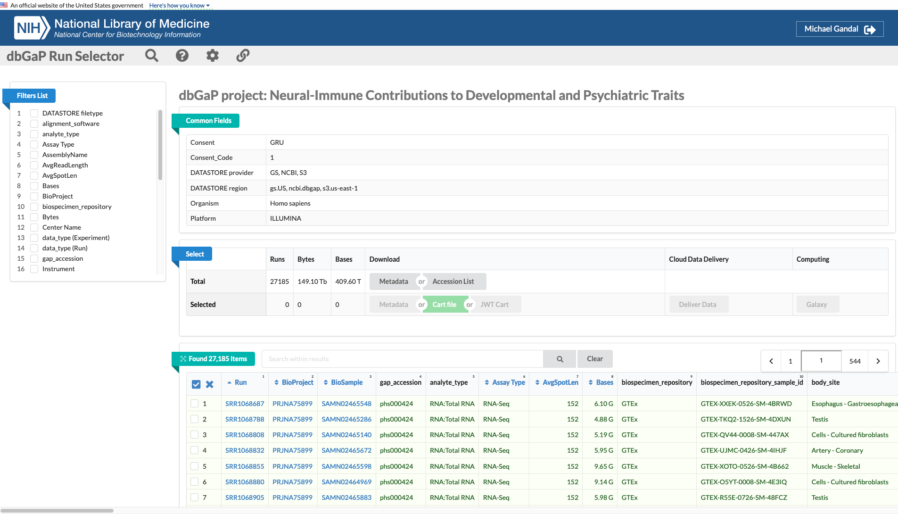

# Prefetch

To download data from dbGaP, there is a necessary prefetch step to download the
SRA files before decrypting the data to FASTQ. To do that, you will need a few
things:  

* Repository key (.ngc file)
* List of reads to download, which can be given as a:
    * Cart file (.krt file)
    * Text file with the accession names
    * List of accession names given directly to the command line


The repository key has already been downloaded onto Hoffman2 and Respublica.

* Respublica: `/mnt/isilon/gandal_lab/shared/dbGaP_2024/prj_36559.ngc`
* Hoffman2: `/u/project/gandalm/shared/dbGAP/repositoryKeys/prj_36559.ngc`

If you need to download a new repository key, login to Mike's NIH account on the
[dbGaP site](https://www.ncbi.nlm.nih.gov/gap/). Then, navigate to dbGaP's
[My Research Projects](https://dbgap.ncbi.nlm.nih.gov/aa/wga.cgi?page=list_wishlists).
There will be a link on the current projects titled "get dbGaP repository key"
that will initiate a download for the repository key.  

The other item you need is the list of reads that you want to download. For
example, if you want to download data from NABEC, navigate to the
[NABEC's dbGaP page](https://www.ncbi.nlm.nih.gov/projects/gap/cgi-bin/study.cgi?study_id=phs001300.v4.p1).
If you navigate to the Molecular Datasets tab, there will be a link to the Run
Selector for the study. Here, you can use the filters and checkboxes to select
the data you want to download from NABEC.


Once you have selected the reads you want, you have a few ways to download the
list of runs. One is to download the Accession List, which is a text file with
the accession number of each run on separate lines throughout the file. These
accession numbers correspond to the Run column in the Run Selector.  

Alternatively, the Accession List option may be absent from your download
options. One alternative is to download the Cart file, which is a binary file
with the .krt extension that will also list the desired runs, albeit not in a
human readable format.



Finally, there is the option of downloading the metadata and parsing out the Run
column. Once your list of runs have been downloaded, you can now call the
`prefetch` command.

```{bash}
# Assuming you have SRA Toolkit in your PATH
# Otherwise call the commands with the path to the binary
# Also assumes you have run `vdb-config -i` for initial setup

## From the Accession List
cat SRR_Acc_List.txt | \
xargs -n 1 \
prefetch \
--ngc /mnt/isilon/gandal_lab/shared/dbGaP_2024/prj_36559.ngc \
-O output_directory_for_sras/

## From the Cart file
prefetch \
--ngc /mnt/isilon/gandal_lab/shared/dbGaP_2024/prj_36559.ngc \
cart_project_id_time_of_download.krt \
-O output_directory_for_sras/

## From Metadata file, assuming Run column is first column
awk 'NR>1 {print $1}' SraRunTable.txt | \
xargs -n 1 \
prefetch \
--ngc /mnt/isilon/gandal_lab/shared/dbGaP_2024/prj_36559.ngc \
-O output_directory_for_sras/

# If only a few runs are needed, you can put the run accession number directly in
# the command call
prefetch \
--ngc /mnt/isilon/gandal_lab/shared/dbGaP_2024/prj_36559.ngc \
-O output_directory_for_sras/ \
SRR12345678
```

The `xargs` command allows the prefetch command to process one run at a time,
which is piped in from `cat`- or `awk`-ing  out the list of runs.