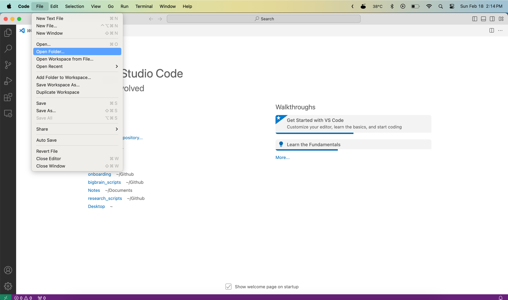
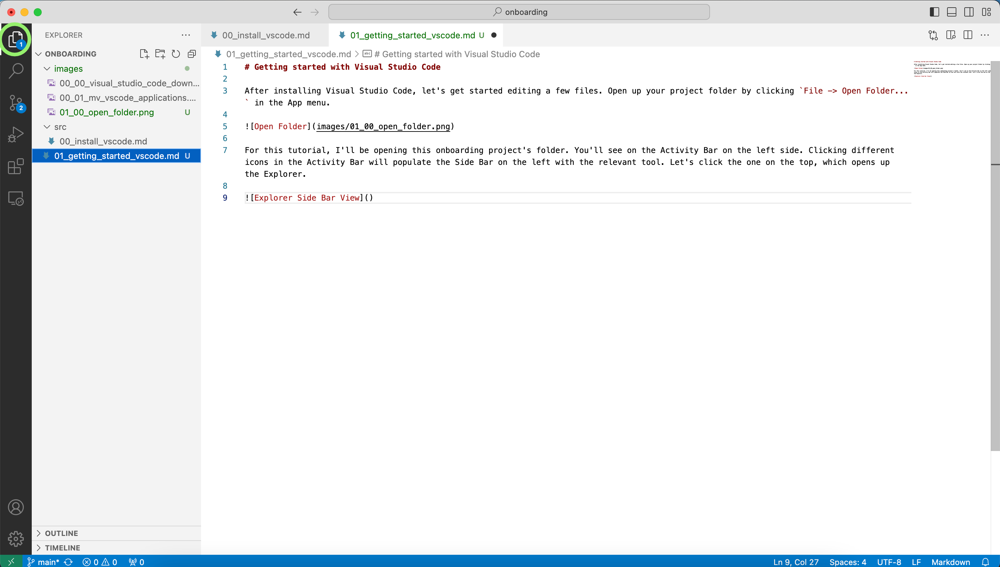
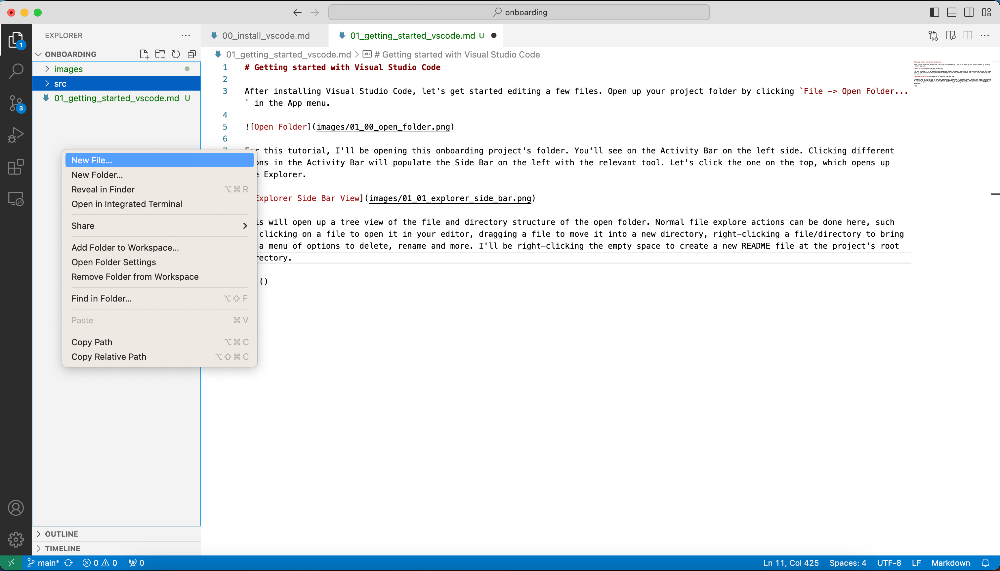
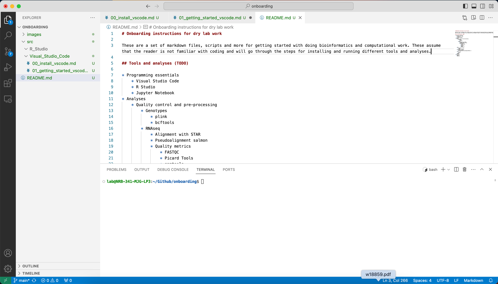
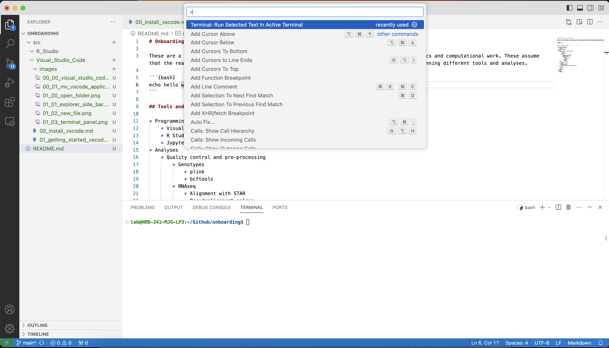
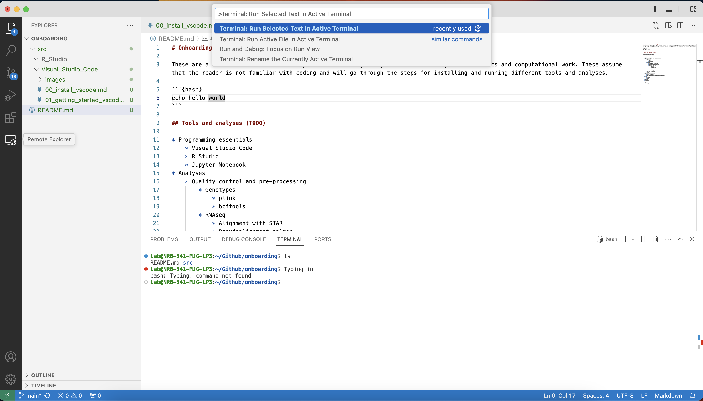
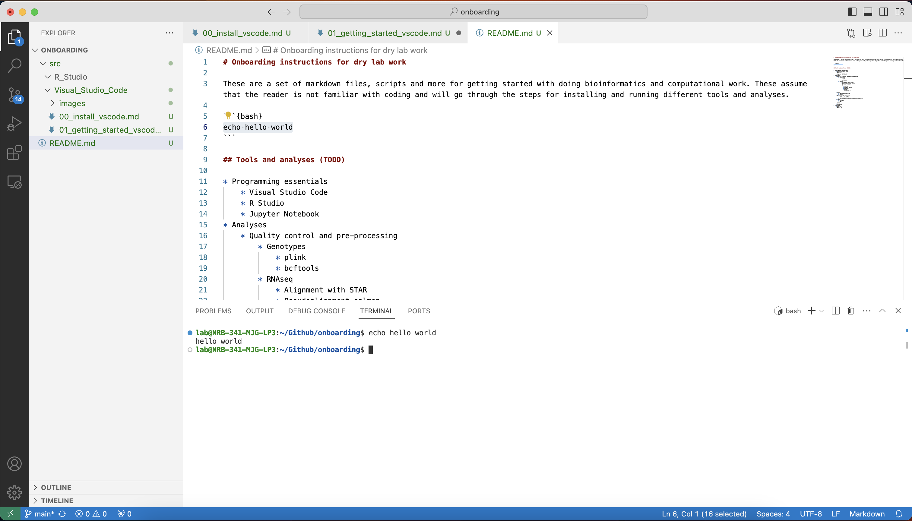
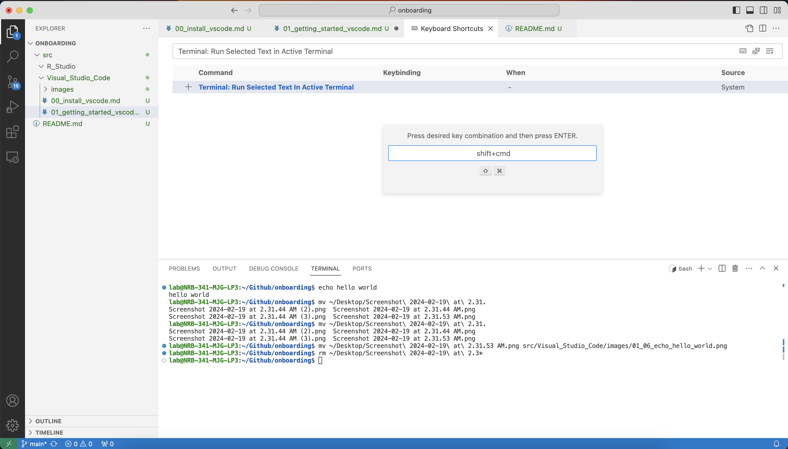
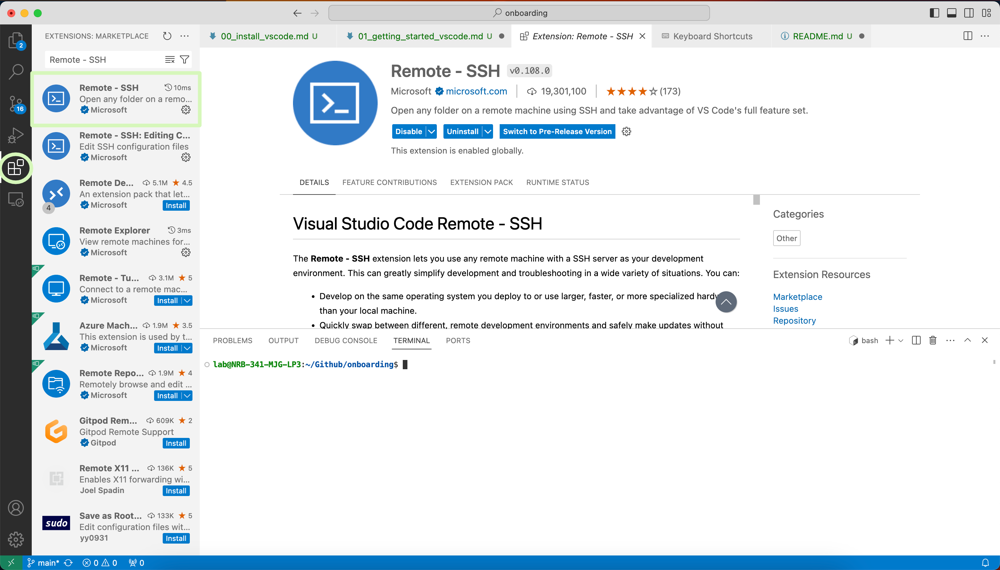
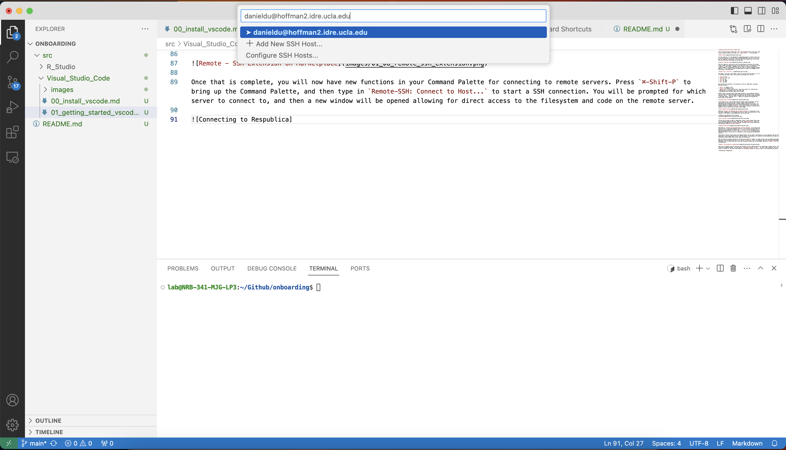

# Getting started with Visual Studio Code

After installing Visual Studio Code, let's get started editing a few files. Open
up your project folder by clicking `File -> Open Folder...` in the App menu.  



For this tutorial, I'll be opening this onboarding project's folder. You'll see
on the Activity Bar on the left side. Clicking different icons in the Activity
Bar will populate the Side Bar on the left with the relevant tool. Let's click
the one on the top, which opens up the Explorer.



This will open up a tree view of the file and directory structure of the open
folder. Normal file explore actions can be done here, such as clicking on a file
to open it in your editor, dragging a file to move it into a new directory,
right-clicking a file/directory to bring up a menu of options to delete, rename
and more. I'll be right-clicking the empty space to create a new README file at
the project's root directory.



This opens a new tab in your Editor, which you can get started typing in. A lot
of features you expect from a text editor are present here, such as:  

* `⌘-Z` for undo
* `⌘-Shift-Z` for redo
* `⌘-X` for cut
* `⌘-C` for copy
* `⌘-P` for paste
* `⌘-S` for save
* `Ctrl-Number` to switch tabs

More options are available in the App menu at the top. Additional convenient
features include:  

* `Ctrl-]` to indent a line
* `Ctrl-[` to unindent a line
* `Option-Click` to use multi-cursors. This can be useful for inserting and
  editing text on multiple lines at the same time.
* Autocomplete with variable names and file names

Another useful function Visual Studio Code provides is the integrated terminal.
You can bring up the Panel housing the terminal at the bottom of your screen by
pressing ``Ctrl-```. This will open a terminal with the current working directory
as the open folder. Pressing ``Ctrl-``` again will minimize the terminal and
return focus to the editor.  



If you want to run a line of code from your editor into the terminal, you can
copy and paste into your terminal. However, Visual Studio Code offers
alternative and customizable ways to do programming actions such as that. The
default method for sending the current line to the terminal is by opening the
Command Palette by pressing `⌘-Shift-P`, which opens a prompt at the top of the
window for you to control Visual Studio Code through.



Entering `Terminal: Run Selected Text in Active Terminal` or selecting it from
the search suggestions in the Command Palette will send the selected text to the
terminal. If there is no selected text, the current line is sent.





Calling that function by name is cumbersome; luckily, Visual Studio Code allows
us to customize keyboard shortcuts. Open up the `Keyboard Shortcuts` editor by
pressing the Manage icon in the Activity Bar (the gear icon on the bottom left)
and selecting `Keyboard Shortcuts [⌘K ⌘S]`.  



Searching for `Terminal: Run Selected Text in Active Terminal` will bring up the
function and its associated keyboard shortcuts. This function currently does not
have any; we can add one by clicking the `+` icon on its row and typing in the
desired keyboard shortcut. For me, I set it to `Ctrl-C Ctrl-C` (pressing the key
combination twice), you can set it to whatever is most convenient and memorable
for you.  

These editor features, specifically the Command Palette and the editor
customization, are very powerful and can really improve your editor experience.
As you become more familiar with the editor, I encourage you to explore the
functionalities the editor provides and personalize Visual Studio Code to your
needs and preferences.  

One last thing for getting started is setting up your editor to connect to
remote servers such as Hoffman2 and Respublica. Visual Studio Code does not have
remote access built in, but the Marketplace offers an extension that will add
that functionality. First, click the Extensions icon in the Activity Bar, which
will bring up a search bar in the sidebar. Search for `Remote - SSH` and install
the extension from Microsoft.  



Once that is complete, you will now have new functions in your Command Palette
for connecting to remote servers. Press `⌘-Shift-P` to bring up the Command
Palette, and then type in `Remote-SSH: Connect to Host...` to start a SSH
connection. You will be prompted for which server to connect to, and then a new
window will be opened allowing for direct access to the filesystem and code on
the remote server.

